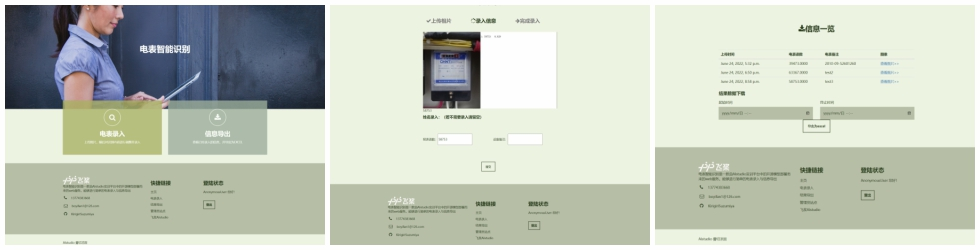
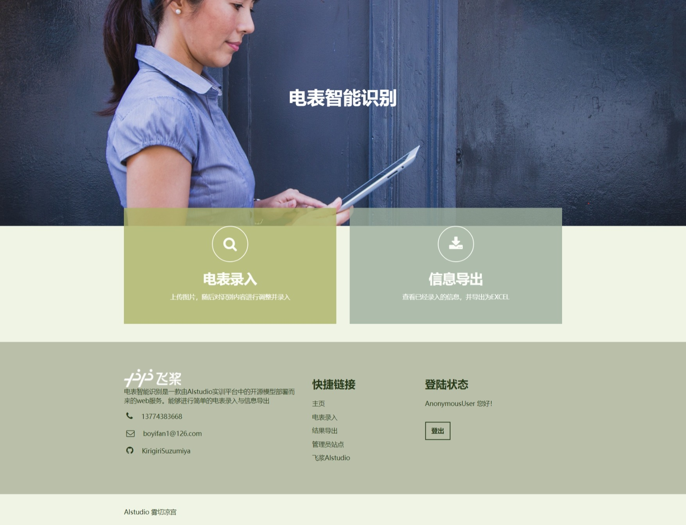
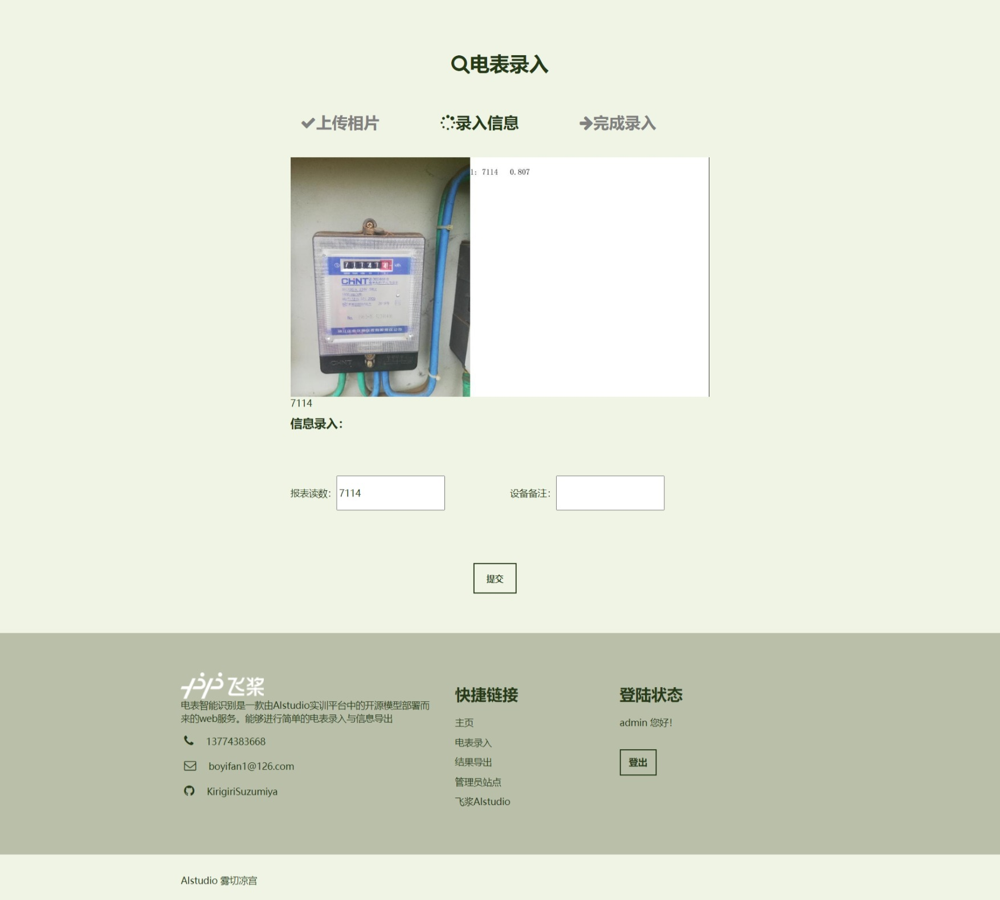
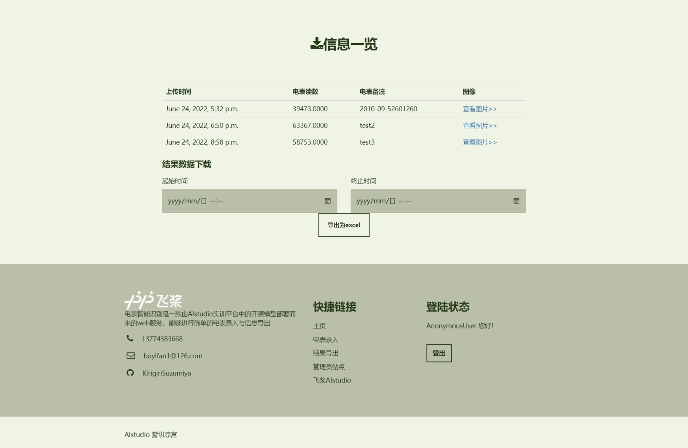
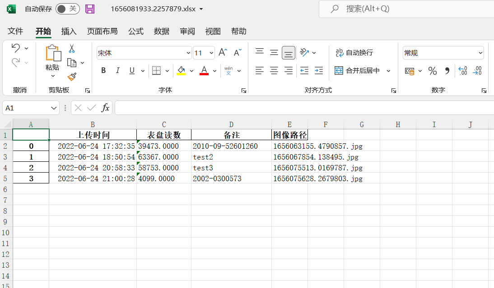

# 电表检测WEB部署方案

前置项目：https://aistudio.baidu.com/aistudio/projectdetail/3429765





## 1. 前言


### 1.1 为什么选择WEB

WEB平台能够方便的实现跨平台使用而不需要多次编译与开发。且本项目背景不要求很高的实时反馈fps，运用web平台上传图片完成处理需要的一定延时可以容忍。故选择使用WEB平台进行部署，可以方便地在各类移动平台上进行数据的上传，可以节省移动设备的开支更可以方便地进行数据的统一管理。


### 1.2 其他的注意事项

- 由于在AIstudio的notebook上跑web毫无意义，主要是没法测试也没法访问，所以代码不再放进notebook的code cell中，需要测试可以自行下载公开版本中的**压缩包文件**
- 模型储存路径为**"根目录/det_db"**，如有需要直接替换即可（也许从此变成django部署的demo？我在做梦）
- WEB部署是在家里捣鼓一天出来的，有许多问题暂时还没有完善，望大家指正
- 本项目只考虑对开头所说的前置项目进行WEB部署，**未对模型进行任何优化或修改**。


## 2. Django开发

Python要做web自然只有Django，这里只讨论Django的开发过程，具体上云部署各位可以各显神通（我觉得这个东西并发量应该不会很高把，应该）


这里就根据**MVC开发框架**的顺序来介绍

### 2.1 模型（Model）

数据建模定义文件在 dbmodel 目录（app）下：

models.py

```python
from django.db import models

# Create your models here.
class Info(models.Model):
    number = models.DecimalField(decimal_places=4, max_digits=100, blank=True, null=True)
    info = models.TextField(max_length=1000,blank=True, null=True)
    image = models.CharField(max_length=1000)
    upload_time = models.DateTimeField()

    def __str__(self):
        return self.image

```

也没很多字段要定义，简单的定义了

- 读数（number）字段

- 备注（info）字段

- 路径（image）字段

- 上传时间（upload_time）字段

  

### 2.2 视图（View）

视图定义文件在 electric_meter 目录下：

views.py

```python
from django.contrib import messages
from django.http import HttpResponseRedirect, FileResponse
from django.shortcuts import render
from .infer import *
from .settings import BASE_DIR
import os
import time
import datetime
import pandas
from dbmodel.models import Info
from django.contrib import auth
from django.contrib.auth.models import User


def recognition(request):
    return render(request, "image_upload.html")


def index(request):
    return render(request, "index.html", {})


def pic_upload(request):
    submit_pic = request.FILES.get('pic')
    pic_suffix = submit_pic.name.split(".")[-1]  # 获取后缀
    pic_path = os.path.join(str(time.time()) + "." + pic_suffix)  # 构造文件路径
    with open(os.path.join(BASE_DIR, "upload", pic_path), "wb") as f:
        for line in submit_pic:
            f.write(line)
    img_path = os.path.join(BASE_DIR, "upload", pic_path)
    try:
        result = electric_meter(img_path)
    except:
        messages.error(request, '您上传的文件不是合法的图片文件')
        return HttpResponseRedirect('/recognition')

    context = {}
    context["upload_states"] = "上传成功！%s" % result
    context["total_path"] = os.path.join(pic_path)
    result_list = []
    for i in range(len(result)):
        result_list.append(result[i][-1][0])

    try:
        result1 = result_list[0]
    except:
        result1 = ''
    try:
        result2 = result_list[1]
    except:
        result2 = ''
    context["result1"] = result1
    context["result2"] = result2
    context["result_list"] = result_list
    for i in result_list:
        if len(i) >= 7:
            context["result2"] = i
    return render(request, 'info_upload.html', context)


def info_upload(request):
    number = request.POST["num"]
    info = request.POST["info"]
    path = request.POST["path"]
    upload_time = os.path.basename(path)[:os.path.basename(path).rfind(".")]
    upload_time = time.strftime(r"%Y-%m-%d %H:%M:%S", time.localtime(eval(upload_time)))
    db_obj = Info(number=number, info=info, image=path,upload_time=upload_time)
    db_obj.save()
    messages.error(request, "信息上传成功！")
    return HttpResponseRedirect("/recognition")


def info_list(request):
    infos = Info.objects.all()
    info_view = []
    for info in infos:
        info_view.append([info.upload_time, info.number, info.info, info.image])
    return render(request, "info_list.html", {"infos": info_view})


def to_excel(request):
    try:
        start = datetime.datetime.strptime(request.POST["start"], "%Y-%m-%dT%H:%M")
        end = datetime.datetime.strptime(request.POST["end"], "%Y-%m-%dT%H:%M")
        result = []
        for info in Info.objects.all():
            if start <= info.upload_time.replace(tzinfo=None) <= end:
                result.append([info.upload_time, info.number, info.info, info.image])
    except:
        result = []
        for info in Info.objects.all():
            result.append([info.upload_time.replace(tzinfo=None), info.number, info.info, info.image])
    df = pandas.DataFrame(result)
    df.columns = ['上传时间', '表盘读数', '备注', '图像路径']
    xls_name = os.path.join(BASE_DIR, "static", "temp_xls", "%s.xlsx" % str(time.time()))
    df.to_excel(xls_name, sheet_name="电表数据导出")
    response = FileResponse(open(xls_name, 'rb'))
    response['content_type'] = "application/octet-stream"
    response['Content-Disposition'] = 'attachment; filename=' + os.path.basename(xls_name)
    return response


def user_view(request):
    try:
        context = {'info': request.GET['message']}
    except:
        context = {'info': "请先登录!"}
    return render(request, "user.html", context)


def user_oper(request):
    username = request.POST['username']
    password = request.POST['password']
    operat = request.POST['operat']
    if operat == "login":
        user = auth.authenticate(request, username=username, password=password)
        if user is not None:
            auth.login(request, user)
            # Redirect to a success page.
            messages.error(request, "登陆成功！")
            return HttpResponseRedirect('index')
        else:
            # Return an 'invalid login' error message.
            messages.error(request, "用户名或密码错误！")
            return HttpResponseRedirect('user?message=用户名或密码错误！')
    elif operat == "register":
        try:
            user = User.objects.create_user(username=username, password=password)
        except:
            messages.error(request, "用户名已存在！")
            return HttpResponseRedirect('user?message=用户名已存在！')
        return HttpResponseRedirect('user?message=注册成功，请登陆！')


def logout_view(request):
    auth.logout(request)
    messages.error(request, "用户已登出！")
    return HttpResponseRedirect('index')
```

又臭又长，实际功能可以与urls.py文件对照查看。

- index 显示主页，没啥处理
- recognition 显示图片上传页，也没啥处理
- pic_upload 接收表单提交的图片文件，路径存储并调用模型预测
- info_upload 接收第二次表单提交，接收电表读数及备注并存入数据库
- info_list 从数据库中拿出所有记录并显示列表
- to_excel 接收表单信息中的时间上下界，并把数据用pandas写入xlsx，最后通过fileresponse提供下载服务
- user_view user_oper logout_view 用户登录、注册、登出相关功能


### 2.3 控制器（Urls）

路由定义文件在 electric_meter 目录下：

urls.py

```python
from django.contrib import admin
from django.urls import path
from . import views
from django.contrib.auth.decorators import login_required

urlpatterns = [
    path('admin/', admin.site.urls),
    path("index", views.index),
    path("", views.index),
    path('recognition', login_required(views.recognition)),
    path('pic_upload', login_required(views.pic_upload)),
    path("info_upload", login_required(views.info_upload)),
    path("info_list", login_required(views.info_list)),
    path("to_excel", login_required(views.to_excel)),
    path(r'user', views.user_view),
    path(r'user_oper', views.user_oper),
    path(r'logout', views.logout_view),
]

```

### 2.4 其他设置

配置app、中间件、静态文件路径等，修改不大不细说

settings.py

```python

from pathlib import Path
import os
# Build paths inside the project like this: BASE_DIR / 'subdir'.
BASE_DIR = Path(__file__).resolve().parent.parent


# Quick-start development settings - unsuitable for production
# See https://docs.djangoproject.com/en/3.2/howto/deployment/checklist/

# SECURITY WARNING: keep the secret key used in production secret!
SECRET_KEY = 'django-insecure-xqc+r+b3$#j%7b^jkstyf&(&b5uxa$$3h9tq%u3h4_wpo^w**-'

# SECURITY WARNING: don't run with debug turned on in production!
DEBUG = True

ALLOWED_HOSTS = []


# Application definition

INSTALLED_APPS = [
    'django.contrib.admin',
    'django.contrib.auth',
    'django.contrib.contenttypes',
    'django.contrib.sessions',
    'django.contrib.messages',
    'django.contrib.staticfiles',
    'dbmodel'
]

MIDDLEWARE = [
    'django.middleware.security.SecurityMiddleware',
    'django.contrib.sessions.middleware.SessionMiddleware',
    'django.middleware.common.CommonMiddleware',
    'django.middleware.csrf.CsrfViewMiddleware',
    'django.contrib.auth.middleware.AuthenticationMiddleware',
    'django.contrib.messages.middleware.MessageMiddleware',
    'django.middleware.clickjacking.XFrameOptionsMiddleware',
]

ROOT_URLCONF = 'electric_meter.urls'

TEMPLATES = [
    {
        'BACKEND': 'django.template.backends.django.DjangoTemplates',
        'DIRS': [os.path.join(BASE_DIR, 'templates')],
        'APP_DIRS': True,
        'OPTIONS': {
            'context_processors': [
                'django.template.context_processors.debug',
                'django.template.context_processors.request',
                'django.contrib.auth.context_processors.auth',
                'django.contrib.messages.context_processors.messages',
            ],
        },
    },
]

WSGI_APPLICATION = 'electric_meter.wsgi.application'


# Database
# https://docs.djangoproject.com/en/3.2/ref/settings/#databases

DATABASES = {
    'default': {
        'ENGINE': 'django.db.backends.sqlite3',
        'NAME': BASE_DIR / 'db.sqlite3',
    }
}


# Password validation
# https://docs.djangoproject.com/en/3.2/ref/settings/#auth-password-validators

AUTH_PASSWORD_VALIDATORS = [
    {
        'NAME': 'django.contrib.auth.password_validation.UserAttributeSimilarityValidator',
    },
    {
        'NAME': 'django.contrib.auth.password_validation.MinimumLengthValidator',
    },
    {
        'NAME': 'django.contrib.auth.password_validation.CommonPasswordValidator',
    },
    {
        'NAME': 'django.contrib.auth.password_validation.NumericPasswordValidator',
    },
]


# Internationalization
# https://docs.djangoproject.com/en/3.2/topics/i18n/

LANGUAGE_CODE = 'en-us'

TIME_ZONE = 'UTC'

USE_I18N = True

USE_L10N = True

USE_TZ = True


# Static files (CSS, JavaScript, Images)
# https://docs.djangoproject.com/en/3.2/howto/static-files/

STATIC_URL = '/static/'
STATICFILES_DIRS = [
    os.path.join(BASE_DIR, "static"),
    os.path.join(BASE_DIR, "rec_result")
]
# Default primary key field type
# https://docs.djangoproject.com/en/3.2/ref/settings/#default-auto-field

DEFAULT_AUTO_FIELD = 'django.db.models.BigAutoField'
LOGIN_URL = '/user'
```

### 2.5 模型推理预测

模型推理文件在 electric_meter 目录下：

infer.py

值得一提的是django在启动的时候就会把这些依赖都载入。所以在runserver时就已经定义并载入好了模型。

每次识别调用electric_meter函数，并不需要反复读模型，其实还是很方便的。

```python
from paddleocr import PaddleOCR, draw_ocr
import os
from .settings import BASE_DIR
from PIL import Image
# 模型路径下必须含有model和params文件
ocr = PaddleOCR(det_model_dir=os.path.join(BASE_DIR, "det_db"),
                use_angle_cls=True)


def electric_meter(img_path):
    print(img_path)
    img_path = os.path.join(img_path)
    result = ocr.ocr(img_path, cls=True)
    for line in result:
        print(line)

    # 显示结果
    print("可视化")
    image = Image.open(img_path).convert('RGB')
    boxes = [line[0] for line in result]
    txts = [line[1][0] for line in result]
    scores = [line[1][1] for line in result]
    im_show = draw_ocr(image, boxes, txts, scores)
    im_show = Image.fromarray(im_show)
    im_show.save(os.path.join(BASE_DIR, "rec_result", os.path.basename(img_path)))
    # im_show.show()
    return result


# electric_meter(r"C:\Users\boyif\Desktop\paddle\electric\M2021\IMG_20210724_132657.jpg")


```


## 3. 前端效果

html/css/js啥的代码就不放这里了，没啥意义。直接看效果

### 3.1 主页




### 3.2 电表录入/信息录入




### 3.3 信息导出




### 3.4 导出至excel




## 4. 环境与部署

### 4.1 安装PaddleOCR

```
git clone https://gitee.com/paddlepaddle/PaddleOCR.git
pip install -r requirements.txt
pip install fasttext==0.8.3
pip install paddleocr --no-deps -r requirements.txt
```

### 4.2 安装Django

```
pip install django
```

### 4.3 运行

```
python manage.py runserver 0.0.0.0:80
```

看到**Starting development server at http://0.0.0.0:80/**就是成功了。


## 5. 总结

- 啥也不会，打工部署
- 算法菜逼，只能前端
- AI旭日，夕阳前端
- 坑姐大腿，不抱不行